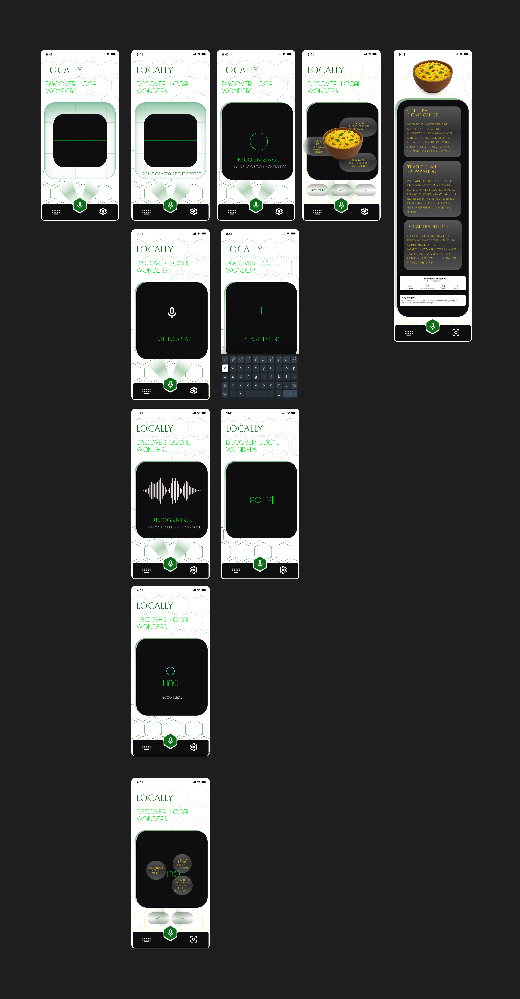

# locally-ar/vr-app-case-study
AR/VR Local Discovery App - UI/UX Design Case Study

COMPANY: CODTECH IT SOLUTIONS

NAME: VANI KOTHARI

INTERN ID: CT08WT259

DOMAIN: UI/UX DESIGNING

DURATION: 8 WEEKS

MENTOR: NEELA SANTOSH

# LOCALLY - AR/VR Local Discovery Application

[](https://github.com/yourusername/locally-arvr-case-study)
[](#)
[](#)

> **Internship Task 4**: Create a User Interface for an AR/VR Application focusing on intuitive interactions

## 📱 Screenshot

<div align="center">
  
</div>

## About

**LOCALLY** is an immersive AR/VR experience designed to help you see a city through its soul.

Whether it's a humble plate of poha, a street-side kulfi cart, or the sound of someone saying "hao", Locally turns everyday sights into cultural stories — all with a scan.

Just point your camera, and the scanned object springs to life as a glowing 3D hologram surrounded by bite-sized info, voice notes, and fun facts. It’s part encyclopedia, part street tour, part nostalgia — all in the palm of your hand.

🌆 Built for curious hearts and wandering feet, Locally helps young explorers connect with unfamiliar cities through hyperlocal elements — language, food, objects, and slang — in the most interactive way possible.

So next time you wonder:
"What's this?"
Just scan it.
Let Locally show you what makes it local.

## Features

- 🎤 **Voice Recognition** - Natural language processing
- 👁️ **Visual Identification** - Real-time object recognition
- 🌍 **Location Context** - GPS-based cultural information
- 🎯 **AR Overlays** - Contextual information display
- ♿ **Accessibility** - Full voice navigation support
- 🏛️ **Cultural Respect** - Authentic local content

## Design Process

### User Research
- **Target Users**: Cultural enthusiasts, locals, accessibility-focused users
- **Key Needs**: Hands-free operation, quick information access, cultural discovery

### Information Architecture
```
App Structure:
├── Voice Hub
├── Recognition Engine
│   ├── Audio Processing
│   ├── Visual Recognition
│   └── Location Context
├── Content Delivery
│   ├── Local Wonders
│   ├── Cultural Info
│   └── Food Discovery
└── User Feedback
```

### User Journey
1. **Activation** → Voice prompt "Tap to Speak"
2. **Recognition** → Audio/visual processing
3. **Discovery** → Contextual information
4. **Exploration** → Detailed cultural content

## User Interface

### Interface States

#### 1. Idle State
- Clean, minimal design
- "Discover Local Wonders" CTA
- Voice activation indicators

#### 2. Voice Activation
- Prominent microphone icon
- "Tap to Speak" instruction
- Visual feedback during capture

#### 3. Processing
- "Recognizing..." status
- Audio waveform visualization
- Real-time feedback

#### 4. Content Delivery
- Rich media presentation
- Scrollable information cards
- Cultural significance details

#### 5. Recognition Complete
- Success confirmation
- Content categorization
- Exploration options

### Design Principles

- **Spatial Awareness**: 3D space consideration for comfort
- **Progressive Disclosure**: Gradual information reveal
- **Cultural Respect**: Authentic content presentation
- **Seamless Integration**: Enhance real-world exploration

## Technical Details

### Voice Processing
1. Audio capture optimization
2. Speech-to-text transcription
3. Intent recognition
4. Content matching

### AR Integration
- World tracking for stable content placement
- Occlusion handling
- 60fps performance optimization
- Cross-platform compatibility

### Accessibility Features
- WCAG 2.1 AA compliance
- Voice-only navigation
- High contrast design
- Large touch targets
db nnn

## Future Enhancements

### Phase 2
- [ ] Social discovery features
- [ ] AR navigation
- [ ] Offline mode
- [ ] Multi-language support

### Advanced Features
- [ ] Gesture control
- [ ] Eye tracking
- [ ] Haptic feedback
- [ ] AI-powered recommendations

## Contact

**Vani Kothari** - [kotharivani5@gmail.com](mailto:kotharivani5@gmail.com)
 
LinkedIn: [linkedin.com/in//vanikothari/](https://linkedin.com/in//vanikothari/)  
GitHub: [github.com/vani-kothari](https://github.com/vani-kothari)

---

## Acknowledgments

- Cultural heritage research contributors
- AR/VR development community
- Accessibility advocates
- Local community participants

---

*Built as part of internship portfolio demonstrating AR/VR UI/UX design capabilities*
